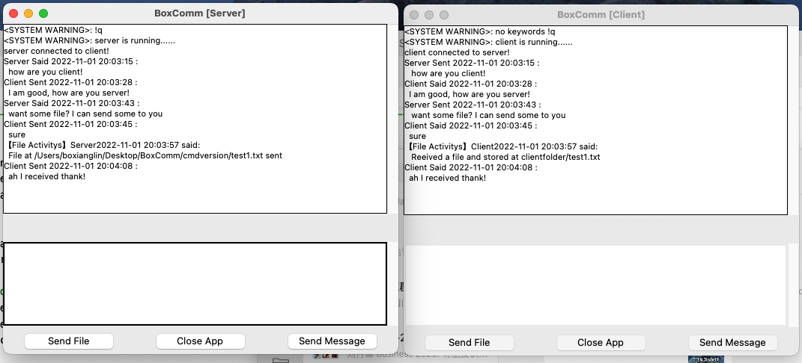

# BoxComm

**Provided 2 versions of client-server communication:**
1. command line (experimental of transferring messages and files, didnt handle disconnection)
2. graphical user interfaces (functional transffering messages and files and disconnection and better GUI)

**Features**
- simultaneously send and receive messages
- simultaneously send and receive files 

**Software Architecture**
`3 threads running `
- 1. main thread comes from the program itself provided actions 
- 2. message listen thread implemented for listening messages coming from other side
- 3. file listen thread implemented for listening file coming from other side

**GUI APP DEMO**

**Command Line Version**
- Note that a constrain for command line is that, file to be transfer must in the /BoxComm/cmdversion/ directory
